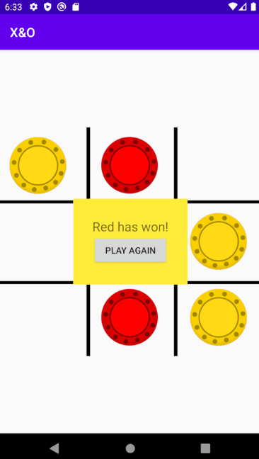

This app represents a simple game of tic-tac-toe made for Android devices

It start's with an board made with a Grid Layout and a tic-tac-toe background

The game starts by selecting a position in te grid
The yellow player will always be the first
After that, it changes the player turn with every round

The three possible scenarios are:
RED WINS

YELLOW WINS

And DRAW

After each ending scenario the game can be replayed by pressing the Play Again button.
HAVE FUN!
